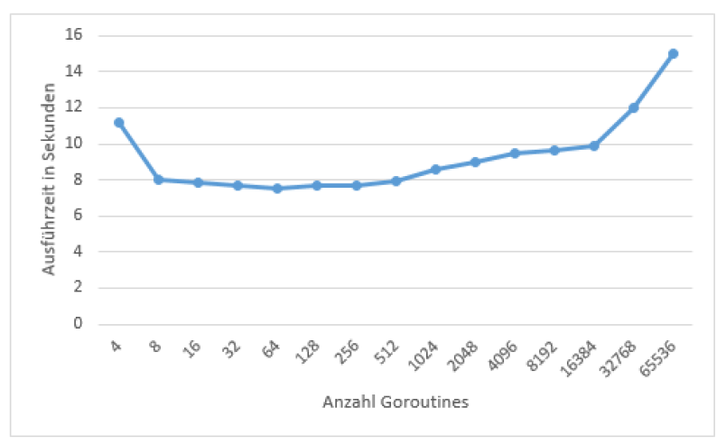
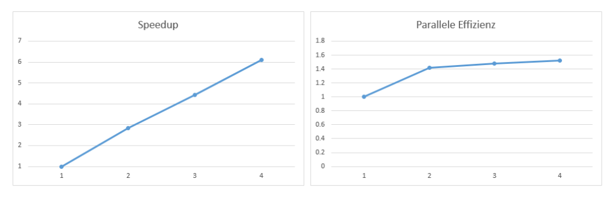

## Overview
Database operations benefit by using multiple CPU cores simultaneously. How well they perform depends of their implementation, though.
Goal of this project is to make a speedup analysis of a parallel hash join using go’s multithreading capabilities by using its light weighted thread called goroutines. This project also shows, how important the right amount of goroutines is, depending on the number of available cores.
Execution Environment:
- Windows 10
- Intel i5-2500K (L1 = 256KB, L2 = 1MB, L3 = 6MB)
- 12GB Memory

Following graphic shows, the execution time of the algorithm using a different amount of goroutines:

The best fit for my execution environment is to use 64 goroutines. Using the optimal amount of goroutines, the speedup and parallel efficiency looks as following:

Here we can see, that the speed up nearly linear. The parallel efficiency greater one is due to the parallel design of the algorithm, where there is an unnecessary overhead while using only one core.
## Prerequisites
Go Version 1.8.1 or newer
